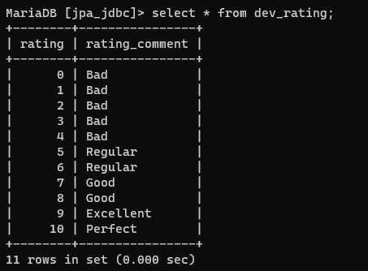
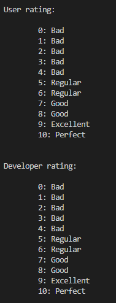
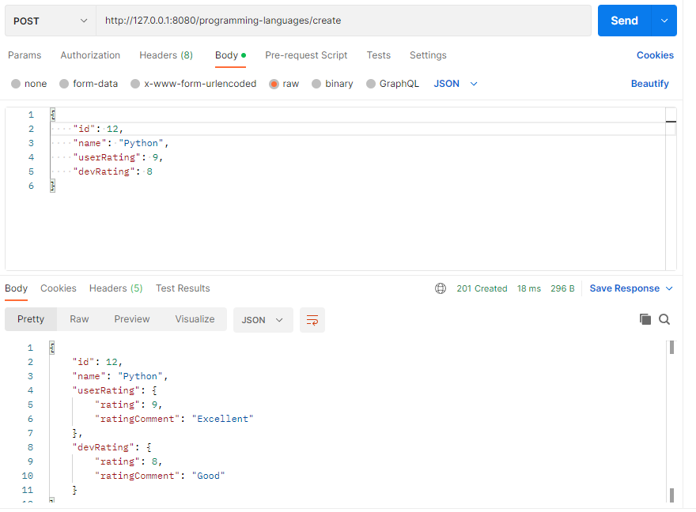
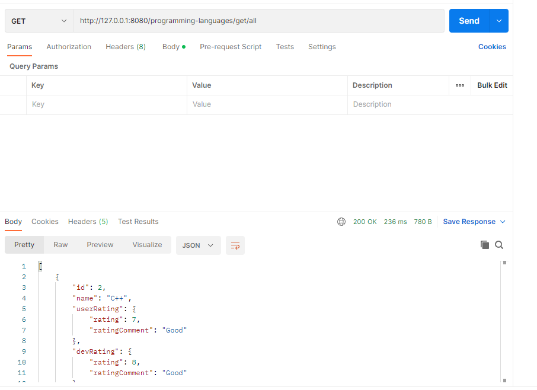

# MariaDB - JPA, JDBC, & Spring Boot

**Table of contents**

- [MariaDB - JPA, JDBC, \& Spring Boot](#mariadb---jpa-jdbc--spring-boot)
  - [Introduction](#introduction)
    - [Database Schema](#database-schema)
  - [How to install](#how-to-install)
  - [How to use](#how-to-use)
    - [AppJPA in the terminal](#appjpa-in-the-terminal)
    - [AppSpringBoot in Postman and Endpoints](#appspringboot-in-postman-and-endpoints)
      - [Create](#create)
      - [Get all](#get-all)
      - [Get one](#get-one)
      - [Update](#update)
      - [Delete](#delete)

## Introduction

This is an asignment made for the Databases assignature. We were asked to create a project of our choice using and combining the knowledge we adquired about [Plain and Pool Connection with JDBC](https://mariadb.com/resources/blog/how-to-connect-java-applications-to-mariadb-using-jdbc/), and [connection with JPA/Hibernate](https://dzone.com/articles/getting-started-with-jpahibernate) to a MariaDB database.

After thinking about it, we decided to try and create an API REST using Java, JPA, and Spring Boot. We hoped to use the logic we made with JPA to access the database (as it used also the Pool Connection of JDBC, which is better than a simple Plain Connection; and using the three of them at the same time would redundant), but when implementing the Spring Boot framework to construct the API REST, we realized that it was not possible, and ended up using the JPA version that already came with Spring Boot instead, which we found it was much more easy and intuive than the raw use of JPA with the use of the Hibernate ORM.

In the end, and to preserve our work with JPA, we ended up with two different `App` files: `AppJPA`, which works with the pure version of JPA/Hibernate; and `AppSpringBoot`, which initiates the Spring Boot API REST using the JPA version of Spring Boot. We'll talk about how each of them work in more detail below.

Finally, a mention of honor to [JLDJR2481](https://github.com/JLDJR2481) for the amazing work he did to make Spring Boot work. Good work, partner!

### Database Schema

The database have three tables:   

- `programming_language`
- `dev_rating`
- `user_rating`

   

The rating tables have the same values, and are used as reference for certain fields in the `programming_language` table. There are two fields:   

- **`rating`:** The rating of the language, which also acts as an ID.
- **`rating_comment`:** The qualification assigned to the rating.

   
   

The table `programming_language` have 4 fields:

- **`id`:** The ID of the programming language.
- **`name`:** The name of the programming language.
- **`dev_rating`:** The rating of the language given by a developer. This is a foreign key, referencing to the ID of the `dev_rating` table.
- **`user_rating`:** The rating of the language given by a user. This is a foreign key, referencing to the ID of the `user_rating` table.

   

## How to install

You will need to have already installed: `Git`, `Java 19`, `Maven`, and `MariaDB`.   

1. First, open the terminal and go to the folder in which you desire to clone the repository. When you're inside, clone the repository:

    ```
    git clone https://github.com/ncocana/MariaDB-JPA-JDBC.git
    ```

2. Open the MariaDB Client/Terminal and create a database:   

       

3. Now create an user and grant them privileges:

      

4. You have two options now. The first one it's to use the JPA App. This one it's constructed to create the tables, introduce the default data in the rating tables, and insert some mock data on the `programming_language` table with example on how to show the data through the terminal, update, and delete it. And finally close the connection when finishing executing.   

    If you wish to use this option, you would have to personalize the code yourself, which can be cumbersome and user-friendly at the long run. The JPA App is also configuring to drop the table and create anew each time it executes itself. Therefore, I wouldn't recommend this option unless you wish to experiment with the code yourself.   

    To execute it, run the `AppJPA.java` file. The output should be similar to this:   

      
      

5. The second option it's use the Spring Boot App, which as the name indicates, it uses the Spring Boot framework. For this, you can execute the `AppSpringBoot.java` file directly or write on the terminal the command: `mvn spring-boot:run`.

## How to use

### AppJPA in the terminal

As its use have already been explained above, all that remains to know is how to configure the database connection. For this, you will need to go to the `persistance.xml` file in `src/main/resources/META-INF` folder, where you can configure the user's name, password, URL for the MariaDB database connection, its action upon executing the `AppJPA.java` file (for default, it's configured to drop and create the database anew; if you wish to just create the database, you will need to change it to `create`), and similar.   

### AppSpringBoot in Postman and Endpoints

To configure the user's name, password, URL for the MariaDB database connection, and such, you will need to go to the `application.properties` file in `src/main/resources` folder.   

You can test the endpoints in Postman:   

[](https://god.gw.postman.com/run-collection/26400016-52e5e2b9-d189-47fb-b0c7-dad85356eaa0?action=collection%2Ffork&collection-url=entityId%3D26400016-52e5e2b9-d189-47fb-b0c7-dad85356eaa0%26entityType%3Dcollection%26workspaceId%3Db6e3eeac-770e-4cce-8f61-a31866271e87)

#### Create

Creates an item in the `programming_language` table. `create` can be used with or without especifying the ID, as even if you don't, the application is configured to automatically assign an ID to the item created.   

```
http://127.0.0.1:8080/programming-languages/create
```

   

If you don't assign an ID, it's possible you will see something like `"ratingComment": null` on the return response. Don't worry, it's not an error. The item have been created correctly and if you do `get` to see the item, you will find the `ratingComment` are no longer null but properly assigned.   

If this bothers you, you can avoid it assign an ID before creating the item. However, keep in mind that if it is an ID that has already been used previously but the item to which was assigned upon not longer exists in the database, upon creating the item, the ID specified on the Request Body will be ignored and instead it will assign the item a new ID that has not been used already.   

   

#### Get all

Gets all the items in the `programming_language` table.   

```
http://127.0.0.1:8080/programming-languages/get/all
```

   

#### Get one

Gets the item especified from the `programming_language` table.   

```
http://127.0.0.1:8080/programming-languages/get/{id}
```

 

#### Update

Updates the item especified from the `programming_language` table. You will need to specify the data updated in the Request Body.   

```
http://127.0.0.1:8080/programming-languages/update/{id}
```

 

#### Delete

Deletes the item especified from the `programming_language` table. There's no need to specify the data deleted in the Request Body, with the id on the endpoint it's enough.   

```
http://127.0.0.1:8080/programming-languages/delete/{id}
```

 
